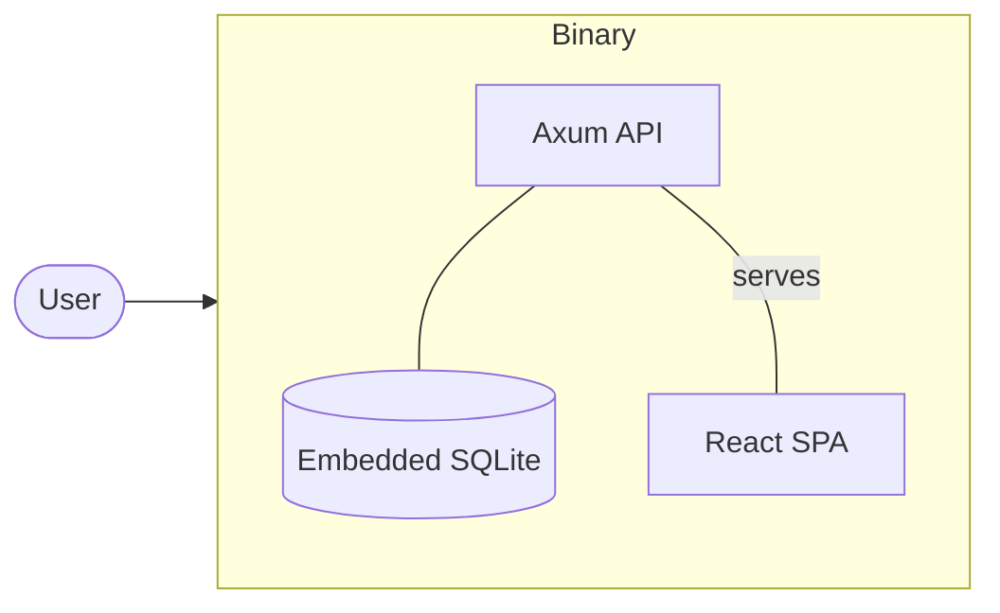

# ☁️ MyCloudX

**Secure, lightweight, and ultra-fast personal media cloud.** 🚀

MyCloudX is a modern personal media platform designed for privacy, speed, and efficiency. It bundles a high-performance Rust backend, a responsive React frontend, and an embedded SQLite database into a single, tiny container (~20MB).

---

## ✨ Key Features

*   **🔒 End-to-End Encryption (E2EE):** Zero-knowledge security using `AES-256-GCM` and `Argon2ID`. Your data is encrypted before it ever leaves your device.
*   **🤝 Collaborative Albums:** Share your memories with friends and family. Assign roles (Viewer/Contributor) and manage permissions securely.
*   **🔔 Real-time Notifications:** Stay updated with instant alerts for new shares, invites, and system activities.
*   **⚡ Ultra-lightweight:** 
    *   **Binary Size:** ~20MB
    *   **RAM Usage:** <50MB
    *   **Cold Start:** <1s
*   **📱 Mobile Optimized:** Responsive design with advanced touch gestures, including range-based selection and optimized media viewer.
*   **☁️ Multi-Cloud Sync:** Seamlessly integrate with S3, Google Drive, and local storage via the `cloud-store` bridge.

---

## 🛠️ Tech Stack

| Layer | Technology | Key Libraries |
|---|---|---|
| **Backend** | Rust (Axum) | `tokio`, `sqlx`, `anyhow` |
| **Frontend** | React + Vite | `TailwindCSS`, `Framer Motion` |
| **Database** | SQLite (Embedded) | `sqlx` (Runtime migration) |
| **Security** | E2EE | `argon2`, `aes-gcm`, `hkdf` |
| **Media** | High Perf Processing | `image`, `mozjpeg`, `blurhash` |
| **Deployment** | Single Binary | `rust-embed`, `scratch` Docker image |

---

## 🚀 Quick Start (Development)

Set up your development environment in seconds:

```ps1
# Terminal 1: Backend (Auto-migrates SQLite)
cd backend
cargo run

# Terminal 2: Frontend (Proxies to :3000)
cd frontend
npm install
npm run dev
```

---

## 🏗️ Architecture

MyCloudX follows a **monolithic-binary** architecture. The entire stack is compiled into a single executable:



---

## 📊 Comparison: MyCloudX vs. Others

| Metric | Traditional Apps | MyCloudX |
|---|---|---|
| **Docker Size** | ~800MB - 1.5GB | **~20MB** |
| **RAM Footprint** | 512MB - 1GB+ | **~30MB** |
| **Cold Start** | 10s - 30s | **<0.5s** |
| **Containers** | 3-5 (App, DB, Cache...) | **1 (All-in-one)** |

---

## 🐳 Docker Deployment

Deploy with maximum efficiency using our `scratch`-based image:

```bash
# Build the production image
.\deploy\build-image.bat

# Launch with Docker Compose
docker compose -f deploy/docker-compose.yml up -d
```

**Default Credentials:**
*   **URL:** `http://localhost`
*   **Email:** `admin@mycloud.local`
*   **Password:** `Admin@123456`

---

## 📃 License

Built with ❤️ by [Antigravity](https://google.com). See [LICENSE](LICENSE) for more details.

